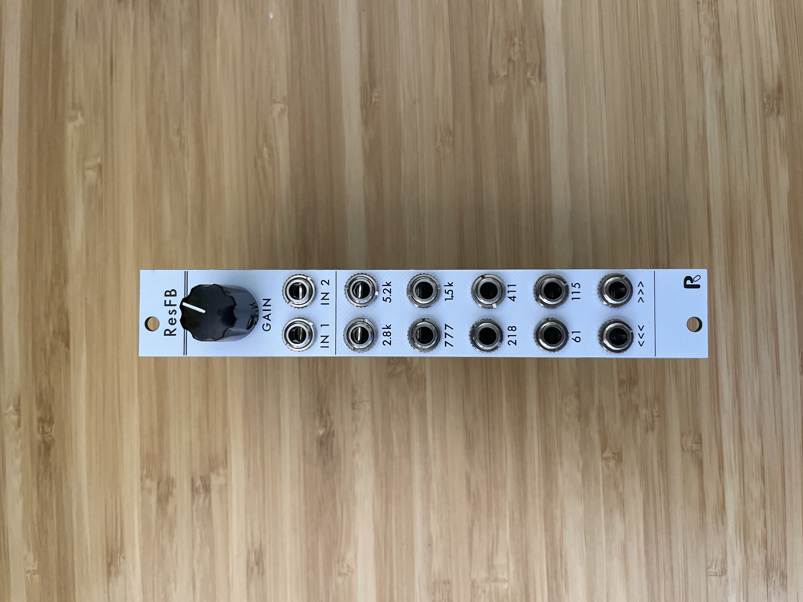

# resffb
4hp eurorack resonant filter bank based on Serge ResEQ

This is a compact fixed filter bank using the same frequencies as the lower 10 bands of the Serge Resonant EQ. It also features comb outs at the bottom, and a secondary input for feedback.

## Schematic and PCBs

The [kicad](KiCAD) directory contains the schematic and PCB layout as a KiCad 6 project.

*Please note this design does not include reverse polarity protection, and keyed headers don't fit within the width - please be careful to make sure that your power cable's polarity is correct!*

## Panel

Available in the [panel](Panel) directory as a PDF and an SVG vector file.

## License

[CC BY-SA 4.0](http://creativecommons.org/licenses/by-sa/4.0/)
